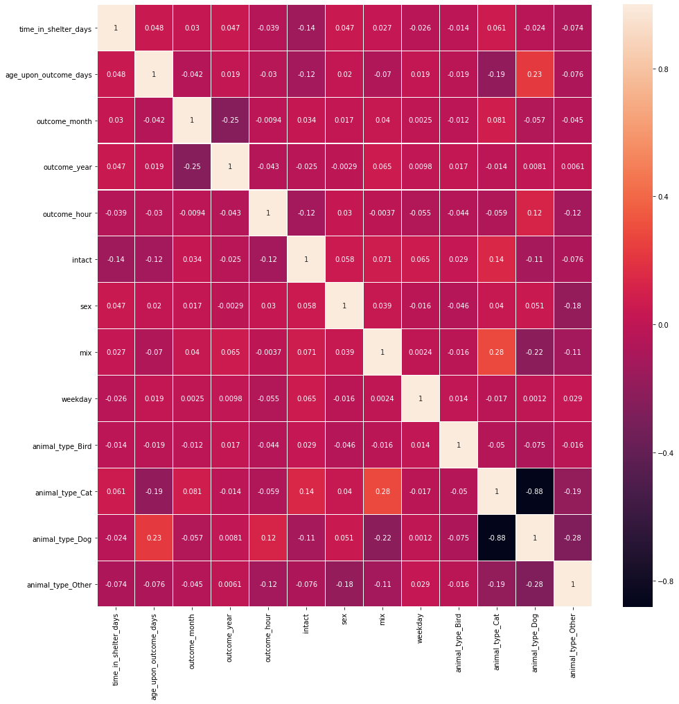
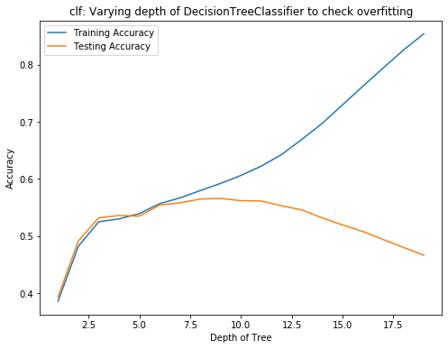

 ## Import Libraries


```python
import matplotlib.pyplot as plt
import seaborn as sns
import numpy as np 
import pandas as pd

Path_train  = 'Animal_State_Prediction/train.csv'
Path_test  = 'Animal_State_Prediction/test.csv'
```

## Path to Data


```python
dtrain = pd.read_csv(Path_train)
dtest = pd.read_csv(Path_test)
```

# Part 1 - Data Wrangling/ Pre-processing/ Cleaning/Feature Engineering
Process of converting or mapping data from original raw form into another format, preparing it for further analysis.
1. Identifying and Handling missing values. (No need)
2. Data Formating. (Get rid of correlated values, identify object types that needs to be converted)
3. Data Normalization(centering and scaling).
4. Data bining.
5. Turning categorical values into numerical values.


## Categorical Columns 
1. animal_type - Cat, Dog etc is important, change to numerical
2. age_upon_intake_age_group

## Highly correlated columns
1. age_upon_intake, age_upon_intake_days , age_upon_intake_years have all same info, keep days.

## Useless columns
1. age_upon_intake, age_upon_intake_days , age_upon_intake_years -  have all same info, keep days.
2. count - always 1, dropped.

## Saving target variable in form of label array 


```python
labels = dtrain['outcome_type'].values
dtrain.drop(['outcome_type'], axis = 1, inplace = True)
```

## concatenate both datasets and perform changes at the same time, split at time of training :
Train - 47803 rows


```python
data = pd.concat([dtrain, dtest])
```

### Fixing Column Names


```python
data.columns = data.columns.str.replace('(', '')
data.columns = data.columns.str.replace(')', '')
# or df.rename 
```

### Drop age_upon_intake object column, info in other columns


```python
data.drop(['age_upon_intake'], axis = 1, inplace=True)
```

### Drop count, useless - always 1.


```python
data.drop(['count'], axis = 1, inplace=True)
```

### Drop age_upon_intake_years as age_upon_intake_days has same info.


```python
data.drop(['age_upon_intake_years'], axis = 1, inplace = True)
```

### Drop age_upon_outcome_years as age_upon_outcome_days has same info.


```python
data.drop(['age_upon_outcome_years'], axis = 1, inplace = True)
```

### Drop time_in_shelter object  as it has a useless type, info in other columns 


```python
data.drop(['time_in_shelter'], axis = 1, inplace = True)
```

### Drop intake_datetime object  as it has a useless type, info in other columns 


```python
data.drop(['intake_datetime'], axis = 1, inplace = True)
```

### Drop outcome_datetime as it has a useless type,  info in other columns


```python
data.drop(['outcome_datetime'], axis = 1, inplace = True)
```

### Drop outcome_monthyear object as outcome month, year have same data


```python
data.drop(['outcome_monthyear'], axis = 1, inplace = True)
```

### Drop date_of_birth object as age_upon_intake_days can have similar data


```python
data.drop(['date_of_birth'], axis = 1, inplace = True)
```

### Drop age_upon_outcome as age_upon_outcome_days has similar data


```python
data.drop(['age_upon_outcome'], axis = 1, inplace = True)
```


```python
data.to_csv('COMBINED_partially_cleaned.csv', index=False)
```

### Checking Correlation 


```python
#sns.heatmap(data.corr(), annot =True, linewidths=0.2)
#fig=plt.gcf()
#fig.set_size_inches(12,12)
#plt.show()

```

## Feature Engineering Is absolutely Required - Adding Columns

### 1. Whether animal is neutered - intact (done)
### 2. Whether animal is mix - mix (done)
### 3. Animal Sex - Sex (done)
### 4. Weekday or Not for outcome  - Weekday (done)
### 5. Simplify Color  - simplecolor (done)
### 6. Simplify Breed - breed (Done)
### 7. Split animal type into One hot vector- pd.get_dummies


```python
data_copy = data
# when Continuing with feature engineering
#data_copy = pd.read_csv('COMBINED_feature_engineered_partially_cleaned.csv')
```

### 1. Whether animal is neutered - intact 

Filtering which animals have been neutered and spayed, label them as neutered(0) and label all else as intact(1).


```python
# dtest.loc[dtest['animal_type'] == 'Cat', 'outcome_type'] = random.choice(['Adopted','Transfer'])
# sex_upon_outcome
#data_copy['sex_upon_outcome'].value_counts()
data_copy['intact'] = np.nan
```


```python
# Creating Filters
nu_male = (data_copy['sex_upon_outcome'] == 'Neutered Male')
nu_female = (data_copy['sex_upon_outcome'] == 'Spayed Female')
in_male = (data_copy['sex_upon_outcome'] == 'Intact Male')
in_female = (data_copy['sex_upon_outcome'] == 'Intact Female')

# Applying 
data_copy.loc[nu_male,'intact'] = 0
data_copy.loc[nu_female,'intact'] = 0
data_copy.loc[in_male,'intact'] = 1
data_copy.loc[in_female,'intact'] = 1
```

#### Since mean is closer to neutered i.e. most animals are neutered, unknown are also neutered


```python
data['intact'].mean(axis = 0)
data_copy['intact'].replace(np.nan, 0, inplace = True)
```


    0.26124420295820644


### 3. Animal Sex - sex
0 - Male, 1 - Female


```python
data_copy['sex'] = np.nan

# Creating Filters
male = (data_copy['sex_upon_outcome'] == 'Neutered Male')
male_1 = (data_copy['sex_upon_outcome'] == 'Intact Male')
female = (data_copy['sex_upon_outcome'] == 'Spayed Female')
female_1 = (data_copy['sex_upon_outcome'] == 'Intact Female')

# Applying Filters 
data_copy.loc[male_1,'sex'] = 0
data_copy.loc[male,'sex'] = 0
data_copy.loc[female_1,'sex'] = 1
data_copy.loc[female,'sex'] = 1
```


```python
data['sex'].mean(axis = 0)
data_copy['sex'].replace(np.nan, 0, inplace = True)
```


    0.4782662385774265


```python
data_copy['sex'].value_counts()
```


    0.0    44815
    1.0    34857
    Name: sex, dtype: int64


### 2. Whether animal is mix - mix
1 - mix
0 - not mix


```python
data_copy['mix'] = np.nan
#data_copy.breed.value_counts()
## 2155 Different breeds
```


```python
# create filter 
mix_breed = (data_copy['breed'].str.contains("Mix"))
data_copy.loc[mix_breed,'mix'] = 1
data_copy['mix'].replace(np.nan, 0, inplace = True)
```

### 4. Weekday or Not for outcome  - Weekday
1 = for Monday,...Friday
0 = for Saturday, Sunday 


```python
data_copy['weekday'] = np.nan
```


```python
#data_copy['outcome_weekday'].value_counts()
```


```python
# create filters

mon = (data_copy['outcome_weekday'] == 'Monday')
tue = (data_copy['outcome_weekday'] == 'Tuesday')
wed = (data_copy['outcome_weekday'] == 'Wednesday')
thurs = (data_copy['outcome_weekday'] == 'Thursday')
fri = (data_copy['outcome_weekday'] == 'Friday')
sat = (data_copy['outcome_weekday'] == 'Saturday')
sun = (data_copy['outcome_weekday'] == 'Sunday')
```


```python
data_copy.loc[mon,'weekday'] = 1
data_copy.loc[tue,'weekday'] = 1
data_copy.loc[wed,'weekday'] = 1
data_copy.loc[thurs,'weekday'] = 1
data_copy.loc[fri,'weekday'] = 1
data_copy.loc[sat,'weekday'] = 0
data_copy.loc[sun,'weekday'] = 0
```

### 5. Simplify Color  - simplecolor
Color is split into into only first string.


```python
data_copy_1 = data_copy['color']
```


```python
# df2 = pd.DataFrame(df1.State.str.split().tolist(), columns="State State_code".split())

df2 = pd.DataFrame(data_copy_1.str.split(pat = '/').tolist(), columns='prim_color sec_color'.split())
```


```python
df3 = df2['prim_color']
```


```python
df4 = pd.DataFrame(df3.str.split(pat = ' ').tolist(), columns='prim_color sec_color ter_color'.split())
```


```python
# copying back to data

data_copy['color'] = df4['prim_color']
```


```python
#data_copy.color.value_counts()
```

#### Contuing Feature Engineering, Dropping rows taht are highly correlated


```python
data_copy.drop(['outcome_number'], axis = 1, inplace = True)
```


```python
data_copy.drop(['intake_hour'], axis = 1, inplace = True)
```


```python
data_copy.drop(['dob_year'], axis = 1, inplace = True)
```


```python
data_copy.drop(['dob_month'], axis = 1, inplace = True)
```


```python
data_copy.drop(['intake_month'], axis = 1, inplace = True)
```


```python
data_copy.drop(['intake_year'], axis = 1, inplace = True)
```


```python
data_copy.drop(['age_upon_intake_days'], axis = 1, inplace = True)
```

## Converting animal_type to One-Hot Vector


```python
data_copy = pd.get_dummies(data_copy, columns = ['animal_type'])
```


```python
sns.heatmap(data=data_copy.corr(), annot = True, linewidths=0.2)
fig = plt.gcf()
fig.set_size_inches(16,16)
plt.show()
```





```python
data_copy.to_csv('COMBINED_feature_engineered_partially_cleaned.csv', index=False)
```

# Part 2 - Modelling 

<h2>1. Baseline models- 1. Every dog gets adopted, and 2. Dogs randomly returned or adopted, cats randomly transfered or Adopted. Rest Euthanasia </h2>
Gives F1 score of 15.72, 15.82 <br>
Clearly just feature engineering will not result in a good F1 Score  

<h2> 2. Using Decision Tree with GridSearchCV optimised parameters</h2>
F1 score of 47.67.

<h2>3. Random Forrest </h2>
With 100 estimators and max_depth = 8, gives 57% and 54% accuracy. <br>
F1 score 49.99

<h2> 4. XGBoost - Gradient boosted tree ensemble</h2>
F1 score 49.54

<h2> 5. Quick attempt for ANN </h2>
Problem, features not normalized. Using batch normalization layer before first Dense layer to normalize input.
F1 score 42.07


```python
# Loading Data, when just modelling 
data_copy = pd.read_csv('COMBINED_feature_engineered_partially_cleaned.csv')
```

### Splitting back into train, test set 


```python
# labels = dtrain['outcome_type'].values
data_train = data_copy.iloc[0:47803]
data_test = data_copy.iloc[47803:]
```

### Encoding Labels 


```python
from sklearn.preprocessing import LabelEncoder
from sklearn.model_selection import train_test_split

#labels = dtrain['outcome_type'].values

le = LabelEncoder()
le.fit(labels)
enc_labels = le.transform(labels)
```


```python
# Getting this encoding 
le_name_mapping = dict(zip(le.classes_, le.transform(le.classes_)))
print(le_name_mapping)
```

    {'Adoption': 0, 'Died': 1, 'Disposal': 2, 'Euthanasia': 3, 'Missing': 4, 'Relocate': 5, 'Return to Owner': 6, 'Rto-Adopt': 7, 'Transfer': 8}


### Taking in only numeric columns


```python
data_train_new = data_train._get_numeric_data()
data_test_new = data_test._get_numeric_data()
```


```python
# For ANN
dataset_test = data_test_new.values
y = dataset_test[:,:].astype(float)

dataset = data_train_new.values
x = dataset[:,:].astype(float)
```

## 2. Decision Tree

### Results 
Using GridSearchCV,optimised max_depth of 10.Both insample and test accuracy of 54%. F1 score of 47.67.<br>


```python
from sklearn.model_selection import GridSearchCV
from sklearn.tree import DecisionTreeClassifier
```


```python
parameters = [{'max_depth':[x for x in range(1,20)]}]
```


```python
clf = DecisionTreeClassifier()
Grid_1 = GridSearchCV(clf, parameters, cv =4)
Grid_1.fit(data_train_new, enc_labels)
```


    GridSearchCV(cv=4, error_score=nan,
                 estimator=DecisionTreeClassifier(ccp_alpha=0.0, class_weight=None,
                                                  criterion='gini', max_depth=None,
                                                  max_features=None,
                                                  max_leaf_nodes=None,
                                                  min_impurity_decrease=0.0,
                                                  min_impurity_split=None,
                                                  min_samples_leaf=1,
                                                  min_samples_split=2,
                                                  min_weight_fraction_leaf=0.0,
                                                  presort='deprecated',
                                                  random_state=None,
                                                  splitter='best'),
                 iid='deprecated', n_jobs=None,
                 param_grid=[{'max_depth': [1, 2, 3, 4, 5, 6, 7, 8, 9, 10, 11, 12,
                                            13, 14, 15, 16, 17, 18, 19]}],
                 pre_dispatch='2*n_jobs', refit=True, return_train_score=False,
                 scoring=None, verbose=0)


```python
Grid_1.best_estimator_
```


    DecisionTreeClassifier(ccp_alpha=0.0, class_weight=None, criterion='gini',
                           max_depth=6, max_features=None, max_leaf_nodes=None,
                           min_impurity_decrease=0.0, min_impurity_split=None,
                           min_samples_leaf=1, min_samples_split=2,
                           min_weight_fraction_leaf=0.0, presort='deprecated',
                           random_state=None, splitter='best')


```python
Grid_1.score(data_train_new,enc_labels)
```


    0.5434386963161307


#### Using these Hyperparameters


```python
from sklearn.tree import DecisionTreeClassifier
from sklearn.model_selection import cross_val_score
from sklearn.model_selection import cross_val_predict


clf = DecisionTreeClassifier(max_depth=6)
clf.fit(data_train_new, enc_labels)
clf.score(data_train_new, enc_labels)
```


    0.5434386963161307


#### Cross validation of scores 


```python
scores = cross_val_score(clf, data_train_new, enc_labels, cv= 20)
print('The mean of scores is and the standard deviation is', np.mean(scores) , np.std(scores))
```

    The mean of scores is and the standard deviation is 0.5368524837737051 0.04176763819494603


#### Checking scores on test- train sets 


```python
x_train, x_test, y_train, y_test = train_test_split(data_train_new, enc_labels, test_size =0.33, random_state = 42, stratify = enc_labels)
```


```python
clf = DecisionTreeClassifier(max_depth=6)
clf.fit(x_train, y_train)
```


    DecisionTreeClassifier(ccp_alpha=0.0, class_weight=None, criterion='gini',
                           max_depth=6, max_features=None, max_leaf_nodes=None,
                           min_impurity_decrease=0.0, min_impurity_split=None,
                           min_samples_leaf=1, min_samples_split=2,
                           min_weight_fraction_leaf=0.0, presort='deprecated',
                           random_state=None, splitter='best')


```python
clf.score(x_train,y_train)
```


    0.5414949419258149


```python
clf.score(x_test,y_test)
```


    0.5395245641838352


### Feature Importance for tree


```python
fi = pd.DataFrame({'feature': list(data_train_new.columns),
                   'importance': clf.feature_importances_}).\
                    sort_values('importance', ascending = False)
fi.head(20)
```


<div>
<style scoped>
    .dataframe tbody tr th:only-of-type {
        vertical-align: middle;
    }

    .dataframe tbody tr th {
        vertical-align: top;
    }

    .dataframe thead th {
        text-align: right;
    }
</style>
<table border="1" class="dataframe">
  <thead>
    <tr style="text-align: right;">
      <th></th>
      <th>feature</th>
      <th>importance</th>
    </tr>
  </thead>
  <tbody>
    <tr>
      <th>7</th>
      <td>time_in_shelter_days</td>
      <td>0.442068</td>
    </tr>
    <tr>
      <th>8</th>
      <td>age_upon_outcome_days</td>
      <td>0.167934</td>
    </tr>
    <tr>
      <th>13</th>
      <td>intact</td>
      <td>0.141223</td>
    </tr>
    <tr>
      <th>11</th>
      <td>outcome_hour</td>
      <td>0.127687</td>
    </tr>
    <tr>
      <th>2</th>
      <td>age_upon_intake_days</td>
      <td>0.078423</td>
    </tr>
    <tr>
      <th>6</th>
      <td>intake_number</td>
      <td>0.021554</td>
    </tr>
    <tr>
      <th>16</th>
      <td>weekday</td>
      <td>0.008227</td>
    </tr>
    <tr>
      <th>14</th>
      <td>sex</td>
      <td>0.007446</td>
    </tr>
    <tr>
      <th>12</th>
      <td>outcome_number</td>
      <td>0.002431</td>
    </tr>
    <tr>
      <th>4</th>
      <td>intake_year</td>
      <td>0.001057</td>
    </tr>
    <tr>
      <th>5</th>
      <td>intake_hour</td>
      <td>0.001037</td>
    </tr>
    <tr>
      <th>1</th>
      <td>dob_month</td>
      <td>0.000391</td>
    </tr>
    <tr>
      <th>10</th>
      <td>outcome_year</td>
      <td>0.000297</td>
    </tr>
    <tr>
      <th>3</th>
      <td>intake_month</td>
      <td>0.000225</td>
    </tr>
    <tr>
      <th>9</th>
      <td>outcome_month</td>
      <td>0.000000</td>
    </tr>
    <tr>
      <th>15</th>
      <td>mix</td>
      <td>0.000000</td>
    </tr>
    <tr>
      <th>0</th>
      <td>dob_year</td>
      <td>0.000000</td>
    </tr>
  </tbody>
</table>
</div>


### Checking overfitting


```python
# Iterating over max_depth from 1 to n and plotting the accuracy of the model on the test set

dep = np.arange(1,20)

train_accuracy = np.empty(len(dep))    # Members not zero ? floats ?
test_accuracy = np.empty(len(dep))

for i,k in enumerate(dep):
    # Define decision tree
    clf_2 = DecisionTreeClassifier(max_depth = k)
    # Fit the classifier to training data.
    clf_2.fit(x_train,y_train)
    
    # Compute accuracy on train set
    
    train_accuracy[i] = clf_2.score(x_train,y_train)
    
    # Compute accuracy on test set
    
    test_accuracy[i]  = clf_2.score(x_test,y_test)
    
print(train_accuracy)
print(test_accuracy)


# Plotting this train and test accuracy.
plt.figure(figsize=(8,6))
plt.title('clf: Varying depth of DecisionTreeClassifier to check overfitting')
plt.plot(dep, train_accuracy, label = 'Training Accuracy')
plt.plot(dep, test_accuracy, label = 'Testing Accuracy')
plt.legend()
plt.xlabel('Depth of Tree')
plt.ylabel('Accuracy')
plt.show()
```

    [0.38609966 0.48217185 0.52497814 0.53003622 0.53918446 0.55673161
     0.56669164 0.57955539 0.59207568 0.60606344 0.62226802 0.64259398
     0.66910204 0.69710878 0.7294867  0.76195829 0.79393031 0.82537155
     0.85375297]
    [0.39340729 0.49153724 0.53172742 0.53603803 0.5348336  0.5541046
     0.55809826 0.56475436 0.5659588  0.56183835 0.56133122 0.55296355
     0.54567353 0.53179081 0.51936609 0.50795563 0.49388273 0.48012678
     0.46649762]





### Making Predictions and Saving


```python
yhat_tree = clf.predict(y)
res_tree = le.inverse_transform(yhat_tree)
```


```python
res_tree.shape
```


    (31869,)


```python
dnew_tree = data_test
dnew_tree['outcome_type'] = res_tree
dnew_tree[['animal_id_outcome','outcome_type']].to_csv('model_2_tree_d_10.csv', index = False)
```

    /Library/Frameworks/Python.framework/Versions/3.6/lib/python3.6/site-packages/ipykernel_launcher.py:2: SettingWithCopyWarning: 
    A value is trying to be set on a copy of a slice from a DataFrame.
    Try using .loc[row_indexer,col_indexer] = value instead
    
    See the caveats in the documentation: https://pandas.pydata.org/pandas-docs/stable/user_guide/indexing.html#returning-a-view-versus-a-copy
      


## 3. Using Random Forest Classifier
With 100 estimators and max_depth = 8, gives 57% and 54% accuracy. <br>
F1 score 49.99


```python
from sklearn.ensemble import RandomForestClassifier

# Create the model with 100 trees
model = RandomForestClassifier(n_estimators=100, 
                               bootstrap = True,
                               max_features = 'sqrt',
                              max_depth = 6)
# Fit on training data
model.fit(data_train_new, enc_labels)
```


    RandomForestClassifier(bootstrap=True, ccp_alpha=0.0, class_weight=None,
                           criterion='gini', max_depth=6, max_features='sqrt',
                           max_leaf_nodes=None, max_samples=None,
                           min_impurity_decrease=0.0, min_impurity_split=None,
                           min_samples_leaf=1, min_samples_split=2,
                           min_weight_fraction_leaf=0.0, n_estimators=100,
                           n_jobs=None, oob_score=False, random_state=None,
                           verbose=0, warm_start=False)


```python
y_train_pred = model.predict(x_train)

compare = pd.DataFrame({'Y_train': y_train, 'Y_train_pred': y_train_pred})
```

#### Find correlation between y_train and predicted values on train data.


```python
compare['Y_train'].corr(compare['Y_train_pred'])
```


    0.45547413685874494


#### Model Scores


```python
model.score(data_train_new, enc_labels)
```


    0.548961362257599


```python
model.fit(x_train, y_train)
model.score(x_test, y_test)
```


    0.5516957210776545


```python
yhat_rf = model.predict(y)
Yhat_rf_res = le.inverse_transform(yhat_rf)
```


```python
dnew_rf = data_test
dnew_rf['outcome_type'] = Yhat_rf_res
dnew_rf[['animal_id_outcome','outcome_type']].to_csv('model_3_feature_CV_RF_d_10.csv', index = False)
```

    /Library/Frameworks/Python.framework/Versions/3.6/lib/python3.6/site-packages/ipykernel_launcher.py:2: SettingWithCopyWarning: 
    A value is trying to be set on a copy of a slice from a DataFrame.
    Try using .loc[row_indexer,col_indexer] = value instead
    
    See the caveats in the documentation: https://pandas.pydata.org/pandas-docs/stable/user_guide/indexing.html#returning-a-view-versus-a-copy
      


#### Feature Importance


```python
fi = pd.DataFrame({'feature': list(data_train_new.columns),
                   'importance': model.feature_importances_}).\
                    sort_values('importance', ascending = False)

```


```python
fi.head(20)
```


<div>
<style scoped>
    .dataframe tbody tr th:only-of-type {
        vertical-align: middle;
    }

    .dataframe tbody tr th {
        vertical-align: top;
    }

    .dataframe thead th {
        text-align: right;
    }
</style>
<table border="1" class="dataframe">
  <thead>
    <tr style="text-align: right;">
      <th></th>
      <th>feature</th>
      <th>importance</th>
    </tr>
  </thead>
  <tbody>
    <tr>
      <th>7</th>
      <td>time_in_shelter_days</td>
      <td>0.367495</td>
    </tr>
    <tr>
      <th>13</th>
      <td>intact</td>
      <td>0.162850</td>
    </tr>
    <tr>
      <th>8</th>
      <td>age_upon_outcome_days</td>
      <td>0.120544</td>
    </tr>
    <tr>
      <th>2</th>
      <td>age_upon_intake_days</td>
      <td>0.112694</td>
    </tr>
    <tr>
      <th>11</th>
      <td>outcome_hour</td>
      <td>0.091795</td>
    </tr>
    <tr>
      <th>0</th>
      <td>dob_year</td>
      <td>0.045449</td>
    </tr>
    <tr>
      <th>6</th>
      <td>intake_number</td>
      <td>0.028223</td>
    </tr>
    <tr>
      <th>12</th>
      <td>outcome_number</td>
      <td>0.022112</td>
    </tr>
    <tr>
      <th>16</th>
      <td>weekday</td>
      <td>0.012238</td>
    </tr>
    <tr>
      <th>14</th>
      <td>sex</td>
      <td>0.008244</td>
    </tr>
    <tr>
      <th>5</th>
      <td>intake_hour</td>
      <td>0.005817</td>
    </tr>
    <tr>
      <th>4</th>
      <td>intake_year</td>
      <td>0.005816</td>
    </tr>
    <tr>
      <th>15</th>
      <td>mix</td>
      <td>0.005445</td>
    </tr>
    <tr>
      <th>10</th>
      <td>outcome_year</td>
      <td>0.004999</td>
    </tr>
    <tr>
      <th>3</th>
      <td>intake_month</td>
      <td>0.002390</td>
    </tr>
    <tr>
      <th>9</th>
      <td>outcome_month</td>
      <td>0.001960</td>
    </tr>
    <tr>
      <th>1</th>
      <td>dob_month</td>
      <td>0.001929</td>
    </tr>
  </tbody>
</table>
</div>


# 4. Using XGBoost for gradient boosting ensemble of trees 
Gives 49.54 F1 Score. Less than RF.


```python
from xgboost import XGBClassifier
```


```python
x_train, x_test, y_train, y_test = train_test_split(data_train_new, enc_labels, test_size =0.2, stratify = enc_labels)
```


```python
# fit model to training data
model = XGBClassifier(n_estimators=100, learning_rate=0.5, gamma=0, max_depth=6)
model.fit(x_train, y_train)
```


    XGBClassifier(base_score=0.5, booster=None, colsample_bylevel=1,
                  colsample_bynode=1, colsample_bytree=1, gamma=0, gpu_id=-1,
                  importance_type='gain', interaction_constraints=None,
                  learning_rate=0.5, max_delta_step=0, max_depth=6,
                  min_child_weight=1, missing=nan, monotone_constraints=None,
                  n_estimators=100, n_jobs=0, num_parallel_tree=1,
                  objective='multi:softprob', random_state=0, reg_alpha=0,
                  reg_lambda=1, scale_pos_weight=None, subsample=1,
                  tree_method=None, validate_parameters=False, verbosity=None)


```python
y_pred = model.predict(x_test)
predictions = [round(value) for value in y_pred]
```


```python
from sklearn.metrics import precision_score, recall_score, accuracy_score, f1_score

print("Precision = {}".format(precision_score(y_test, y_pred, average='macro')))
print("Recall = {}".format(recall_score(y_test, y_pred, average='macro')))
print("Accuracy = {}".format(accuracy_score(y_test, y_pred)))
print("F1 Score = {}".format(f1_score(y_test, y_pred, average='micro')))
```

    Precision = 0.4296145053869619
    Recall = 0.3577007457138298
    Accuracy = 0.5775546490952829
    F1 Score = 0.5775546490952829


### Making Predictions and Saving


```python
yhat_tree = model.predict(data_test_new)
res_tree = le.inverse_transform(yhat_tree)
dnew_tree = data_test
dnew_tree['outcome_type'] = res_tree
dnew_tree[['animal_id_outcome','outcome_type']].to_csv('model_4_XGB_tree_d_10.csv', index = False)
```

    /Library/Frameworks/Python.framework/Versions/3.6/lib/python3.6/site-packages/ipykernel_launcher.py:5: SettingWithCopyWarning: 
    A value is trying to be set on a copy of a slice from a DataFrame.
    Try using .loc[row_indexer,col_indexer] = value instead
    
    See the caveats in the documentation: https://pandas.pydata.org/pandas-docs/stable/user_guide/indexing.html#returning-a-view-versus-a-copy
      """


## 5. ANN using Keras 
F1 score 42.07.

#### One hot Encoding Target Variable


```python
from keras.utils import np_utils

dummy_labels = np_utils.to_categorical(enc_labels)
```

    Using TensorFlow backend.
    /Users/apple/Library/Python/3.6/lib/python/site-packages/tensorflow/python/framework/dtypes.py:526: FutureWarning: Passing (type, 1) or '1type' as a synonym of type is deprecated; in a future version of numpy, it will be understood as (type, (1,)) / '(1,)type'.
      _np_qint8 = np.dtype([("qint8", np.int8, 1)])
    /Users/apple/Library/Python/3.6/lib/python/site-packages/tensorflow/python/framework/dtypes.py:527: FutureWarning: Passing (type, 1) or '1type' as a synonym of type is deprecated; in a future version of numpy, it will be understood as (type, (1,)) / '(1,)type'.
      _np_quint8 = np.dtype([("quint8", np.uint8, 1)])
    /Users/apple/Library/Python/3.6/lib/python/site-packages/tensorflow/python/framework/dtypes.py:528: FutureWarning: Passing (type, 1) or '1type' as a synonym of type is deprecated; in a future version of numpy, it will be understood as (type, (1,)) / '(1,)type'.
      _np_qint16 = np.dtype([("qint16", np.int16, 1)])
    /Users/apple/Library/Python/3.6/lib/python/site-packages/tensorflow/python/framework/dtypes.py:529: FutureWarning: Passing (type, 1) or '1type' as a synonym of type is deprecated; in a future version of numpy, it will be understood as (type, (1,)) / '(1,)type'.
      _np_quint16 = np.dtype([("quint16", np.uint16, 1)])
    /Users/apple/Library/Python/3.6/lib/python/site-packages/tensorflow/python/framework/dtypes.py:530: FutureWarning: Passing (type, 1) or '1type' as a synonym of type is deprecated; in a future version of numpy, it will be understood as (type, (1,)) / '(1,)type'.
      _np_qint32 = np.dtype([("qint32", np.int32, 1)])
    /Users/apple/Library/Python/3.6/lib/python/site-packages/tensorflow/python/framework/dtypes.py:535: FutureWarning: Passing (type, 1) or '1type' as a synonym of type is deprecated; in a future version of numpy, it will be understood as (type, (1,)) / '(1,)type'.
      np_resource = np.dtype([("resource", np.ubyte, 1)])


#### Defining Model


```python
from keras.models import Sequential 
from keras.layers import Dense
from keras.optimizers import SGD
from keras.layers import BatchNormalization


# Create a dense layer with 8 neurons and input dimension 4 for the flatenned input x, IRIS dataset attributes.
# we need to create a function that returns the model for the scikit-learn wrapper function estimator.

def base_model():
    model = Sequential()
    model.add(BatchNormalization(input_shape=(9,)))
    model.add(Dense(27, input_dim = 9, activation = 'relu'))
    model.add(Dense(9, activation = 'softmax'))

# Learning parameters using model.compile

    model.compile(optimizer = 'adam',
                 loss='categorical_crossentropy',
                 metrics = ['accuracy'])
    
    #opt = SGD(lr=0.1)
    #model.compile(loss = "categorical_crossentropy", optimizer = opt, metrics = ['accuracy'])
    return model
```


```python
model = base_model()

model.fit(x,dummy_labels, batch_size=32, epochs=20)
```

    WARNING:tensorflow:From /Users/apple/Library/Python/3.6/lib/python/site-packages/tensorflow/python/ops/math_ops.py:3066: to_int32 (from tensorflow.python.ops.math_ops) is deprecated and will be removed in a future version.
    Instructions for updating:
    Use tf.cast instead.
    Epoch 1/20
    47803/47803 [==============================] - 3s 59us/step - loss: 1.6803 - accuracy: 0.4462
    Epoch 2/20
    47803/47803 [==============================] - 3s 60us/step - loss: 1.5713 - accuracy: 0.4855
    Epoch 3/20
    47803/47803 [==============================] - 3s 59us/step - loss: 1.5582 - accuracy: 0.4879
    Epoch 4/20
    47803/47803 [==============================] - 3s 57us/step - loss: 1.5509 - accuracy: 0.4895
    Epoch 5/20
    47803/47803 [==============================] - 3s 62us/step - loss: 1.5464 - accuracy: 0.4907
    Epoch 6/20
    47803/47803 [==============================] - 6s 122us/step - loss: 1.5431 - accuracy: 0.4916
    Epoch 7/20
    47803/47803 [==============================] - 5s 100us/step - loss: 1.5390 - accuracy: 0.4913
    Epoch 8/20
    47803/47803 [==============================] - 3s 60us/step - loss: 1.5346 - accuracy: 0.4932
    Epoch 9/20
    47803/47803 [==============================] - 3s 62us/step - loss: 1.5333 - accuracy: 0.4946
    Epoch 10/20
    47803/47803 [==============================] - 5s 98us/step - loss: 1.5334 - accuracy: 0.4944
    Epoch 11/20
    47803/47803 [==============================] - 4s 83us/step - loss: 1.5326 - accuracy: 0.4917
    Epoch 12/20
    47803/47803 [==============================] - 3s 65us/step - loss: 1.5321 - accuracy: 0.4931
    Epoch 13/20
    47803/47803 [==============================] - 3s 67us/step - loss: 1.5304 - accuracy: 0.4941
    Epoch 14/20
    47803/47803 [==============================] - 3s 59us/step - loss: 1.5297 - accuracy: 0.4940
    Epoch 15/20
    47803/47803 [==============================] - 3s 61us/step - loss: 1.5303 - accuracy: 0.4917
    Epoch 16/20
    47803/47803 [==============================] - 3s 60us/step - loss: 1.5287 - accuracy: 0.4961
    Epoch 17/20
    47803/47803 [==============================] - 3s 60us/step - loss: 1.5277 - accuracy: 0.4937
    Epoch 18/20
    47803/47803 [==============================] - 3s 65us/step - loss: 1.5266 - accuracy: 0.4954
    Epoch 19/20
    47803/47803 [==============================] - 3s 55us/step - loss: 1.5263 - accuracy: 0.4940
    Epoch 20/20
    47803/47803 [==============================] - 4s 75us/step - loss: 1.5249 - accuracy: 0.4960


    <keras.callbacks.callbacks.History at 0x13f1ffcf8>


```python
yhat = model.predict_classes(y)
res = le.inverse_transform(yhat)
```


```python
dnew = data_test
dnew['outcome_type'] = res
dnew[['animal_id_outcome','outcome_type']].to_csv('model_5_ANN.csv', index = False)
```
